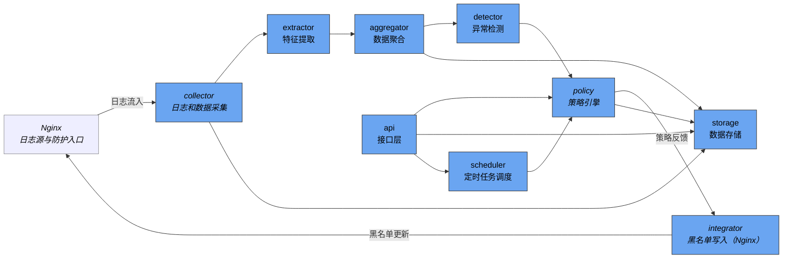

## Sentinel 项目简介

Sentinel 是一个基于异常检测和策略引擎的安全监控系统，旨在实时收集、分析和检测网络数据中的异常行为，帮助用户及时发现潜在的安全风险。

## 功能概述

- 实时数据采集与处理
- 特征提取与聚合
- 异常检测（基于孤立森林算法）
- 策略引擎驱动的安全响应
- 与 Nginx 等服务的集成，自动化应用安全策略
- 定时任务调度管理
## 系统设计图说明

以下为 Sentinel 系统的主要模块及其数据流关系示意图，展示了各模块间的交互和功能定位，以及与 Nginx 的集成关系：


## 项目结构

```
├── api/                  # 接口层，提供外部访问与交互
│   └── __init__.py       # api包初始化文件
├── config/               # 配置层，负责加载和解析配置文件
│   ├── __init__.py       # config包初始化文件
│   └── loader.py         # 配置加载模块
├── core/                 # 核心逻辑层，包含采集、聚合、检测等核心业务逻辑
│   ├── __init__.py       # core包初始化文件
│   ├── aggregator/       # 数据聚合处理子模块
│   │   ├── __init__.py   # aggregator包初始化文件
│   │   └── aggregator.py # 聚合逻辑实现
│   ├── collector/        # 日志和数据采集子模块
│   │   ├── __init__.py   # collector包初始化文件
│   │   └── tailer.py     # 采集逻辑实现
│   ├── detector/         # 异常检测算法实现子模块
│   │   ├── __init__.py   # detector包初始化文件
│   │   └── iforest.py    # 孤立森林算法实现
│   ├── features/         # 特征提取逻辑子模块
│   │   ├── __init__.py   # features包初始化文件
│   │   └── extractor.py  # 特征提取实现
│   ├── integrator/       # 与外部系统集成子模块（如Nginx）
│   │   ├── __init__.py   # integrator包初始化文件
│   │   └── nginx_writer.py # Nginx集成实现
│   ├── policy/           # 策略引擎实现子模块
│   │   └── policy_engine.py # 策略引擎核心代码
│   ├── scheduler/        # 定时任务调度子模块
│   │   ├── __init__.py   # scheduler包初始化文件
│   │   └── scheduler.py  # 调度逻辑实现
│   ├── utils/            # 辅助工具函数子模块
│   │   └── __init__.py   # utils包初始化文件
├── data/                 # 数据存储层，包含模型文件和数据库文件
│   ├── model/            # 存放模型文件
│   └── sentinel.db       # 数据库文件
├── logs/                 # 日志存放目录
├── main.py               # 程序入口文件
├── models/               # 数据模型定义层
│   ├── __init__.py       # models包初始化文件
│   └── ip_record.py      # IP记录数据模型
├── pyproject.toml        # 项目配置文件
├── scripts/              # 辅助脚本目录
├── setting.yaml          # 系统配置文件
├── storage/              # 数据库存储相关操作层
│   ├── __init__.py       # storage包初始化文件
│   └── database.py       # 数据库操作实现
├── tests/                # 测试代码目录
│   └── __init__.py       # tests包初始化文件
└── uv.lock               # 依赖锁定文件
```

- **collector**：负责实时采集日志和网络数据。  
- **extractor**：从采集的数据中提取关键特征。  
- **aggregator**：对特征数据进行聚合处理，形成分析基础。  
- **detector**：基于聚合数据执行异常检测算法（如孤立森林）。  
- **policy**：根据检测结果执行策略决策，触发相应响应。  
- **integrator**：将策略结果应用于外部系统（如 Nginx）实现自动化防护。  
- **storage**：持久化存储数据、模型和检测结果。  
- **scheduler**：管理定时任务，定期触发检测和策略执行。  
- **api**：提供外部访问接口，支持数据查询和管理操作。

## 模块说明

- **api/**  
  提供系统对外的接口定义和实现，支持外部调用和数据交互。

- **config/**  
  配置加载模块，负责读取和解析系统配置文件。

- **core/**  
  核心业务逻辑模块，包含数据聚合、采集、检测、特征提取、集成、策略和调度等子模块：
  - aggregator：数据聚合处理。
  - collector：日志和数据采集。
  - detector：异常检测算法实现。
  - features：特征提取逻辑。
  - integrator：与外部系统（如 Nginx）的集成。
  - policy：策略引擎实现。
  - scheduler：定时任务调度。
  - utils：辅助工具函数。

- **data/**  
  存储模型文件和数据库文件。

- **logs/**  
  系统运行日志目录，用于存放日志文件，便于问题排查和运行监控。

- **models/**  
  数据模型定义，包含数据库实体和数据结构。

- **storage/**  
  数据库存储相关操作，实现数据的持久化管理。

- **scripts/**  
  辅助脚本目录，包含部署、维护等脚本文件。

- **tests/**  
  单元测试和集成测试代码。

## 运行方式

1. 克隆项目代码至本地。  
2. 安装依赖环境（详见依赖安装方式）。  
3. 根据实际环境修改 `setting.yaml` 配置文件。  
4. 运行主程序：  
   ```bash
   python main.py
   ```

## 依赖安装方式

推荐使用 Python 3.8 及以上版本，依赖通过 `uv` 管理。可使用以下命令安装依赖：

```bash
uv sync
```

## 配置说明

系统配置文件为 `setting.yaml`，包含以下主要配置项：

- 数据库连接信息  
- 日志级别与路径  
- 采集与检测参数  
- 策略引擎配置  
- 集成服务相关配置（如 Nginx）

请根据实际部署环境调整配置内容，确保系统正常运行。

## 日志目录说明

`logs/` 目录用于存放系统运行过程中产生的日志文件。日志文件记录了系统的运行状态、错误信息及调试信息，方便运维人员进行监控和故障排查。建议定期备份和清理日志文件以节省磁盘空间。
