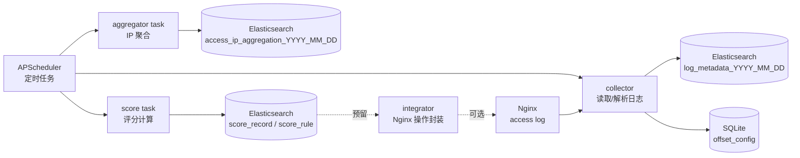

## Sentinel 项目简介

Sentinel 是一个面向 Nginx 访问日志的安全分析与评分系统：定时从日志增量读取数据，写入 Elasticsearch；按批次对访问 IP 行为做聚合与特征统计，并基于可配置评分规则计算风险分值（为后续黑名单/限流等策略落地预留能力）。

## 功能概述

- Nginx 访问日志增量采集（按偏移量续读）
- 日志解析结构化并写入 Elasticsearch（按天索引）
- 按 5 分钟批次聚合 IP 访问行为，生成统计特征与行为向量
- 基于评分规则（安全表达式）计算风险分并写入 Elasticsearch
- GeoIP 与内网段白名单信息 enrich（可选）
- APScheduler 定时任务调度（采集/聚合/评分/清理）
- Nginx 操作封装（测试/重载/启停，策略落地待补充）
## 系统设计图说明

以下为 Sentinel 系统的主要模块及其数据流关系示意图，展示了各模块间的交互和功能定位，以及与 Nginx 的集成关系：


## 项目结构

```
├── api/                  # 接口层（当前未实现业务 API）
│   └── __init__.py
├── config/               # 配置层，负责加载和解析配置文件
│   ├── __init__.py
│   ├── loader.py         # 读取 setting.yaml（Pydantic 校验）
│   └── logger.py         # loguru 日志配置
├── core/                 # 核心逻辑层，包含采集、聚合、检测等核心业务逻辑
│   ├── collector/        # 日志采集
│   │   └── log_collector.py
│   ├── detector/         # 评分引擎与安全表达式求值器
│   │   ├── evaluator.py
│   │   └── score_engine.py
│   ├── integrator/       # Nginx 操作封装
│   │   └── nginx.py
│   ├── scheduler/        # 定时任务调度与任务实现
│   │   ├── scheduler.py
│   │   └── tasks/
│   └── utils/            # URL 解析与 path 类型判断
│       └── url_utils.py
├── data/                 # SQLite / GeoIP 等数据
│   ├── GeoLite2-City.mmdb
│   └── sentinel.db
├── logs/                 # 日志存放目录
├── main.py               # 程序入口文件
├── models/               # 数据模型定义层
│   └── ...
├── manager/              # 业务仓储封装（ES/SQLite）
│   └── ...
├── pyproject.toml        # 项目配置文件
├── setting.yaml          # 系统配置文件
├── storage/              # 数据库存储相关操作层
│   ├── database.py       # SQLite（偏移量）
│   └── document.py       # Elasticsearch（索引模板/初始化）
├── tests/                # 测试代码目录
│   └── __init__.py
└── uv.lock               # 依赖锁定文件
```

- **collector**：按偏移量增量读取 Nginx 日志并解析写入 ES。  
- **aggregator task**：对批次内访问 IP 的行为与统计特征做聚合，写入 ES。  
- **score task**：按规则计算风险分，写入 ES。  
- **integrator**：Nginx 操作封装（策略落地待补充）。  
- **scheduler**：定时任务调度与任务状态记录。  
- **storage/manager/models**：ES/SQLite 仓储与数据模型。

## 模块说明

- **api/**  
  当前仅保留目录，未实现业务 API（`main.py` 仅挂载 `static/` 目录）。

- **config/**  
  配置加载模块，负责读取和解析系统配置文件。

- **core/**  
  核心业务逻辑模块：采集（collector）、聚合/评分（scheduler + manager）、评分引擎（detector）、Nginx 封装（integrator）、工具（utils）。`features/` 与 `policy/` 当前为占位待扩展。

- **data/**  
  SQLite 数据库文件与 GeoIP 数据文件。

- **logs/**  
  系统运行日志目录，用于存放日志文件，便于问题排查和运行监控。

- **models/**  
  数据模型定义，包含数据库实体和数据结构。

- **storage/**  
  Elasticsearch 索引模板/初始化与 SQLite 初始化。

- **tests/**  
  单元测试和集成测试代码。

## 运行方式

1. 克隆项目代码至本地。  
2. 安装依赖环境（详见依赖安装方式）。  
3. 根据实际环境修改 `setting.yaml` 配置文件。  
4. 运行主程序：  
   ```bash
   server.sh  start|stop| restart| status
   ```

## 依赖安装方式

推荐使用 Python 3.12 及以上版本（见 `pyproject.toml`），依赖通过 `uv` 管理。可使用以下命令安装依赖：

```bash
uv sync
```

## 配置说明

系统配置文件为 `setting.yaml`，包含以下主要配置项：

- `server`：监听地址/端口、静态目录  
- `nginx`：Nginx 路径、日志路径（支持 `${%Y-%m-%d}` 日期占位符）、conf/黑名单/限流文件路径  
- `elasticsearch`：ES 地址与凭据  
- `database`：SQLite 连接串（用于偏移量）  
- `geoip`：GeoLite2 数据库路径（用于 IP enrich）

请根据实际部署环境调整配置内容，确保系统正常运行。

## 日志目录说明

`logs/` 目录用于存放系统运行过程中产生的日志文件。日志文件记录了系统的运行状态、错误信息及调试信息，方便运维人员进行监控和故障排查。建议定期备份和清理日志文件以节省磁盘空间。
